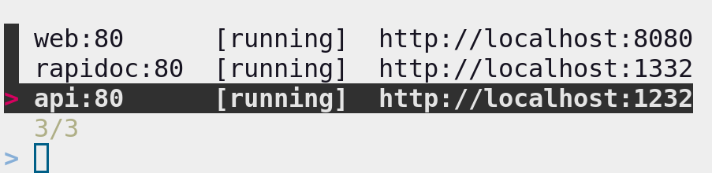

[](https://codecov.io/gh/lonepeon/dclist)

# dclist

A fuzzy finder to open any docker-compose exposed service. This tool is helpful
when juggling with a lot of different projects which does not reuse the same
ports. Remembering the exposed ports per projet is not manageable.

Preview of the CLI output. When selecting one of the line below, it send the
selected line to the shell. The `fzf-dclist` binary is not intended to be used
directly. Instead a shell function should call it in order to fill the prompt
with the expected command.



CLI usage is shown with `--help`

```
Usage: fzf-dclist [OPTIONS]

Options:
      --docker-compose-path <DOCKER_COMPOSE_PATH>
          path to the docker compose binary [default: docker-compose]
      --fzf-path <FZF_PATH>
          path to the fzf binary [default: fzf]
  -h, --help
          Print help
  -V, --version
          Print version
```

## Installation

Pre-requisites:
- docker-compose: in order to list all docker-compose processes
- fzf: in order to display a fuzzy-finder

A pre-built binary for `fzf-dclist` is available on the [release
page](https://github.com/lonepeon/dclist/releases).

## ZSH

Integration to ZSH is as easy as dropping this function in your zshrc:

```zsh
dclist() {
  local cmd=$(fzf-dclist | awk '{ for (i=3; i<=NF; i++) printf "%s ", $i }');
  print -z "${cmd}"
}
```
